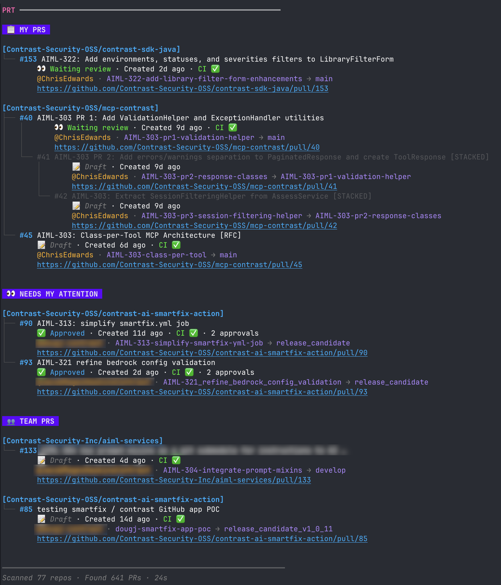

# PRT - GitHub PR Tracker

[](https://opensource.org/licenses/MIT)
[](https://go.dev/)

> Aggregate GitHub PR status across multiple local repositories

PRT solves "PR Fatigue" - the cognitive burden of tracking PRs across many repos. With a single command, see:

- **My PRs** - PRs you authored, waiting for review
- **Needs My Attention** - PRs requesting your review or assigned to you
- **Team PRs** - PRs from your configured team members
- **Stacked PRs** - Visual tree of dependent PR chains



## Features

- **Multi-repo scanning** - Discover Git repos in configured directories
- **Smart categorization** - PRs sorted by your relationship to them
- **Stack detection** - Visualize dependent PR chains (stacked PRs)
- **Bot Author filtering** - Include or exclude dependabot, renovate, GitHub Apps, and known automation accounts
- **Review Decision filtering** - Filter by GitHub's aggregate approval state
- **Beautiful output** - Styled terminal UI with icons
- **JSON output** - Pipe to `jq` for scripting
- **Zero config** - Setup wizard on first run

## Installation

### Homebrew (macOS)

```bash
brew tap ChrisEdwards/tap
brew install prt
```

### Binary Download

Download pre-built binaries from [Releases](https://github.com/ChrisEdwards/pr-tracker/releases).

Available platforms:
- macOS (Intel): `prt_<version>_darwin_amd64.tar.gz`
- macOS (Apple Silicon): `prt_<version>_darwin_arm64.tar.gz`
- Linux (x64): `prt_<version>_linux_amd64.tar.gz`
- Linux (arm64): `prt_<version>_linux_arm64.tar.gz`
- Windows (x64): `prt_<version>_windows_amd64.zip`

### Build from Source

```bash
git clone https://github.com/ChrisEdwards/prt.git
cd prt
make build
./bin/prt
```

## Quick Start

1. **Install the GitHub CLI** (if not already installed):
   ```bash
   brew install gh
   gh auth login
   ```

2. **Run PRT** - the setup wizard launches automatically:
   ```bash
   prt
   ```

3. **Configure your paths and team** in the wizard

4. **Run PRT again** to see your PR dashboard!

## Usage

```bash
# Show PR dashboard (default)
prt

# Scan a specific path
prt -p ~/code/work

# Filter repos by pattern
prt -f "api-*"

# Show newest PRs first
prt -s newest

# Output as JSON for scripting
prt --json | jq '.needs_my_attention | length'

# Show my PRs plus non-draft team PRs that GitHub does not consider approved
prt --author team --draft false --bot false --review-decision not-approved

# Show my PRs plus non-bot Matching PRs
prt --bot false

# Show my PRs plus Matching PRs that GitHub does not consider approved
prt --review-decision not-approved

# Use the built-in review-needed View for the same review workflow
prt --view review-needed

# Narrow the built-in review-needed View with an extra CLI filter
prt --view review-needed --author @alice

# Show my PRs plus PRs authored by a specific user
prt --author @alice

# Disable colors (for piping)
prt --no-color > prs.txt
```

## Command Line Flags

| Flag | Short | Description |
|------|-------|-------------|
| `--path` | `-p` | Override search paths from config |
| `--filter` | `-f` | Filter repos by name pattern (glob) |
| `--author <value>` | | Filter Matching PRs by author: `me`, `team`, `other`, or `@username` |
| `--draft <true\|false>` | | Filter Matching PRs by draft state |
| `--bot <true\|false>` | | Filter Matching PRs by Bot Author status |
| `--review-decision <value>` | | Filter Matching PRs by Review Decision: `approved`, `not-approved`, `review-required`, `changes-requested`, or `none` |
| `--view <name>` | | Apply a named View to Matching PRs; use `--view review-needed` for ready team PRs without approval |
| `--group` | `-g` | Group by: `project` or `author` |
| `--sort` | `-s` | Sort by: `oldest` or `newest` |
| `--depth` | `-d` | Scan depth (default: 3) |
| `--max-age` | | Hide PRs older than N days (0 = no limit) |
| `--json` | | Output as JSON |
| `--no-color` | | Disable colored output |
| `--version` | `-v` | Show version |
| `--help` | `-h` | Show help |

## Configuration

Configuration file: `~/.prt/config.yaml`

```yaml
# Your GitHub username (auto-detected if empty)
github_username: "jdoe"

# Team members - their PRs are highlighted
team_members:
  - "alice"
  - "bob"
  - "charlie"

# Directories to scan for Git repositories
search_paths:
  - "~/code/work"
  - "~/projects/oss"

# Only include repos matching these patterns (empty = all)
include_repos:
  - "myorg-*"
  - "frontend"

# Max directory depth when scanning (default: 3)
scan_depth: 3

# Known Bot Authors (pre-populated, add your own)
bots:
  - "dependabot[bot]"
  - "renovate[bot]"
  - "github-actions[bot]"

# Display options
default_group_by: "project"  # project | author
default_sort: "oldest"       # oldest | newest
show_branch_name: true
show_icons: true
show_other_prs: false        # Show "Other PRs" section

# Filtering options
max_pr_age_days: 0           # Hide PRs older than N days (0 = no limit)

# Custom Views are named filter bundles
views:
  review-needed:
    description: "Ready team PRs that do not have GitHub approval"
    filters:
      author: team
      draft: false
      bot: false
      review_decision: not-approved
```

### Configuration Options

| Option | Default | Description |
|--------|---------|-------------|
| `github_username` | (auto-detect) | Your GitHub username |
| `team_members` | `[]` | GitHub usernames to highlight |
| `search_paths` | `[]` | Directories to scan |
| `include_repos` | `[]` | Glob patterns to filter repos |
| `scan_depth` | `3` | Max directory depth |
| `bots` | (see defaults) | Additional known Bot Authors |
| `default_group_by` | `project` | Group PRs by project or author |
| `default_sort` | `oldest` | Sort by oldest or newest first |
| `show_branch_name` | `true` | Show branch names |
| `show_icons` | `true` | Show emoji icons |
| `show_other_prs` | `false` | Show "Other PRs" section |
| `max_pr_age_days` | `0` | Hide PRs older than N days (0 = no limit) |
| `views` | built-in `review-needed` | Named filter bundles selectable with `--view <name>`; config-defined Views with the same name replace built-ins |

### Environment Variables

All configuration options can be set via environment variables with the `PRT_` prefix. Environment variables override config file values but are overridden by CLI flags.

| Variable | Config Equivalent | Example |
|----------|-------------------|---------|
| `PRT_GITHUB_USERNAME` | `github_username` | `export PRT_GITHUB_USERNAME=jdoe` |
| `PRT_SCAN_DEPTH` | `scan_depth` | `export PRT_SCAN_DEPTH=5` |
| `PRT_DEFAULT_GROUP_BY` | `default_group_by` | `export PRT_DEFAULT_GROUP_BY=author` |
| `PRT_DEFAULT_SORT` | `default_sort` | `export PRT_DEFAULT_SORT=newest` |
| `PRT_SHOW_BRANCH_NAME` | `show_branch_name` | `export PRT_SHOW_BRANCH_NAME=false` |
| `PRT_SHOW_ICONS` | `show_icons` | `export PRT_SHOW_ICONS=false` |
| `PRT_SHOW_OTHER_PRS` | `show_other_prs` | `export PRT_SHOW_OTHER_PRS=true` |
| `PRT_MAX_PR_AGE_DAYS` | `max_pr_age_days` | `export PRT_MAX_PR_AGE_DAYS=30` |

**Configuration precedence** (highest to lowest):
1. CLI flags (`--sort newest`)
2. Environment variables (`PRT_DEFAULT_SORT=newest`)
3. Config file (`~/.prt/config.yaml`)
4. Built-in defaults

## Output Categories

### My PRs
PRs you authored. These are your "outgoing" PRs waiting for review.

### Needs My Attention
PRs where:
- You're requested as a reviewer
- You're assigned to the PR
- You haven't approved yet

### Team PRs
PRs from users in your `team_members` list. Bot Authors are not treated as Team PRs, even if listed in `team_members`.

### Other PRs
Everything else, including:
- External contributors
- Bot Authors (dependabot, renovate, GitHub Apps, etc.)

### Matching PRs
When `--author <value>`, `--draft <true|false>`, `--bot <true|false>`, `--review-decision <value>`, or `--view <name>` is active, PRT keeps My PRs visible and replaces the default Needs My Attention, Team PRs, and Other PRs sections with a single Matching PRs section. Matching PRs never includes your own PRs.

Author filter values:
- `--author me`: PRs authored by your configured/current GitHub user. My PRs still stay in the My PRs section, so Matching PRs is normally empty for this filter.
- `--author team`: PRs authored by configured `team_members`, excluding your configured/current user because My PRs are shown separately and excluding Bot Authors.
- `--author other`: PRs not authored by you, not authored by configured `team_members`, and not authored by Bot Authors.
- `--author @alice`: PRs authored exactly by `alice`.

Draft filter values:
- `--draft true`: PRs whose effective state is draft.
- `--draft false`: PRs whose effective state is not draft.

Bot filter values:
- `--bot true`: PRs authored by Bot Authors.
- `--bot false`: PRs not authored by Bot Authors.

Bot Authors are detected from the configured `bots` list and from usernames ending in `[bot]`.

Review Decision filter values:
- `--review-decision approved`: PRs whose GitHub Review Decision is `APPROVED`.
- `--review-decision not-approved`: PRs whose GitHub Review Decision is anything other than `APPROVED`, including `REVIEW_REQUIRED`, `CHANGES_REQUESTED`, empty/null decisions, and unknown future GitHub values.
- `--review-decision review-required`: PRs whose GitHub Review Decision is `REVIEW_REQUIRED`.
- `--review-decision changes-requested`: PRs whose GitHub Review Decision is `CHANGES_REQUESTED`.
- `--review-decision none`: PRs with an empty/null GitHub Review Decision.

Review Decision filtering uses GitHub's aggregate `reviewDecision` value as the source of truth; it does not infer approval status from individual review records. The `not-approved` filter is independent from draft status, so draft PRs can match unless you also pass `--draft false`.

Views:
- Define Views under top-level `views`.
- Each View may include `description` and must include `filters`.
- Supported View filter keys are `author`, `draft`, `bot`, and `review_decision`.
- Views cannot set display, grouping, sorting, color, or section options in v1.
- `review-needed` is built in and works even when your config has no `views` section. It is equivalent to `prt --author team --draft false --bot false --review-decision not-approved`.
- `prt --view review-needed` keeps My PRs visible and shows Matching PRs for ready Team Member PRs, excluding Bot Authors and PRs whose GitHub Review Decision is `APPROVED`.
- External PRs do not match `review-needed` merely because they request your review; use another View or direct filters for that workflow.
- A config-defined `views.review-needed` replaces the built-in View.
- Additional CLI filters narrow the selected View with AND composition. For example, `prt --view review-needed --author @alice` shows PRs matching both the built-in View and `@alice`.

## Stacked PRs

PRT detects "stacked PRs" - chains of dependent PRs. When a PR targets another PR's branch (instead of main), it's visualized as a tree:

```
├── #402 Feature: Auth
│   └── #405 Tests for Auth (blocked)
```

Child PRs are marked as "blocked" until their parent merges.

## JSON Output

Use `--json` for scripting:

```bash
# Count PRs needing your attention
prt --json | jq '.needs_my_attention | length'

# Count non-draft team PRs matching active filters while excluding Bot Authors
prt --author team --draft false --bot false --json | jq '.matching_prs | length'

# Count PRs GitHub does not consider approved
prt --review-decision not-approved --json | jq '.matching_prs | length'

# List all PR URLs
prt --json | jq '.my_prs[].url'

# Get scan metadata
prt --json | jq '{repos: .total_repos_scanned, prs: .total_prs_found, user: .username}'

# Export to file
prt --json > ~/pr-snapshot.json
```

### JSON Schema

Top-level structure:

| Field | Type | Description |
|-------|------|-------------|
| `my_prs` | `PR[]` | PRs you authored |
| `needs_my_attention` | `PR[]` | PRs requesting your review or assigned to you |
| `team_prs` | `PR[]` | PRs from your configured team members |
| `other_prs` | `PR[]` | All other PRs |
| `matching_prs` | `PR[]` | PRs matching active `--author`/`--draft`/`--bot`/`--review-decision` filters; present when filters are active |
| `repos_with_prs` | `Repository[]` | Repositories with open PRs |
| `repos_without_prs` | `Repository[]` | Repositories with no open PRs |
| `repos_with_errors` | `Repository[]` | Repositories that failed to scan |
| `stacks` | `object` | Map of repo name to Stack (stacked PRs) |
| `total_repos_scanned` | `int` | Number of repositories scanned |
| `total_prs_found` | `int` | Total PR count |
| `scan_duration_ns` | `int` | Scan time in nanoseconds |
| `username` | `string` | Your GitHub username |

PR object:

| Field | Type | Description |
|-------|------|-------------|
| `number` | `int` | PR number |
| `title` | `string` | PR title |
| `url` | `string` | GitHub URL |
| `author` | `string` | Author's GitHub username |
| `state` | `string` | `OPEN`, `DRAFT`, `MERGED`, or `CLOSED` |
| `is_draft` | `bool` | Whether PR is a draft |
| `base_branch` | `string` | Target branch (e.g., `main`) |
| `head_branch` | `string` | Source branch |
| `created_at` | `string` | ISO 8601 timestamp |
| `ci_status` | `string` | `passing`, `failing`, `pending`, or `none` |
| `review_decision` | `string` | GitHub Review Decision, such as `APPROVED`, `REVIEW_REQUIRED`, `CHANGES_REQUESTED`, empty string, or an unknown future value |
| `review_requests` | `string[]` | Usernames requested to review |
| `assignees` | `string[]` | Assigned usernames |
| `reviews` | `Review[]` | Code reviews |
| `repo_name` | `string` | Repository name |
| `repo_owner` | `string` | Repository owner |

Repository object:

| Field | Type | Description |
|-------|------|-------------|
| `name` | `string` | Repository name |
| `path` | `string` | Local filesystem path |
| `remote_url` | `string` | Git remote URL |
| `owner` | `string` | GitHub owner/org |
| `prs` | `PR[]` | PRs in this repository |
| `scan_status` | `string` | `success`, `no_prs`, `error`, or `skipped` |

## Requirements

- **GitHub CLI (`gh`)** - Must be installed and authenticated
- **macOS, Linux, or Windows** - Pre-built binaries available for all platforms
- **Git repositories** - With GitHub remotes

## Troubleshooting

### "gh: command not found"
Install the GitHub CLI:
```bash
brew install gh  # macOS
# or see https://cli.github.com/
```

### "gh is not authenticated"
Authenticate with GitHub:
```bash
gh auth login
```

### No repositories found
Check that:
1. Your `search_paths` are correct in `~/.prt/config.yaml`
2. The directories contain Git repos with GitHub remotes
3. Your `scan_depth` is deep enough

### PRs not showing
- PRs must be **open** (not merged/closed)
- Repo must have a GitHub remote (not GitLab, Bitbucket, etc.)
- Check `gh pr list` works in the repo directory

## Contributing

Contributions welcome! Please:
1. Fork the repository
2. Create a feature branch
3. Run `make setup` to install the pre-commit hook (formats, vets, builds, and tests before every commit)
4. Make your changes
5. Submit a pull request

## Releasing

Releases are automated via GitHub Actions and [goreleaser](https://goreleaser.com/).

### Setup (one-time)

1. Create a Personal Access Token at https://github.com/settings/tokens with `repo` scope
2. Add it as a repository secret named `HOMEBREW_TAP_TOKEN` in Settings > Secrets > Actions

### Creating a Release

```bash
git tag v1.0.0
git push origin v1.0.0
```

This triggers the release workflow which:
- Builds binaries for all platforms (macOS, Linux, Windows)
- Creates a GitHub release with changelog
- Updates the Homebrew formula in [homebrew-tap](https://github.com/ChrisEdwards/homebrew-tap)

## License

MIT License - see [LICENSE](LICENSE) for details.

## Acknowledgments

Built with:
- [Cobra](https://github.com/spf13/cobra) - CLI framework
- [Viper](https://github.com/spf13/viper) - Configuration
- [Lipgloss](https://github.com/charmbracelet/lipgloss) - Terminal styling
- [GitHub CLI](https://cli.github.com/) - GitHub API access
